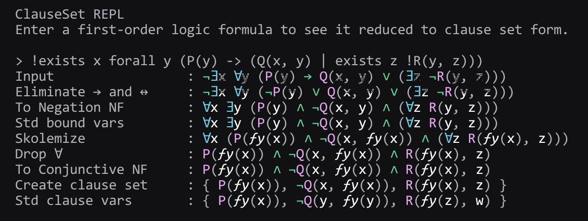

# ClauseSet

这是一个用 TypeScript 实现的一阶逻辑公式转化为子句集工具。

## 习题示例

- [手写过程](./docs/exercises.md)
- [程序输入](./docs/exercises.in) | [程序输出](./docs/exercises.out)

## 使用

### 安装与运行

```bash
pnpm install  # 安装依赖

pnpm build    # 构建项目
pnpm dev      # 或者运行开发服务器

pnpm start                              # 运行 REPL
cat ./docs/exercises.in | pnpm start    # 或者用文件作为输入
```

### 输入

可以在 REPL 中输入任意一阶逻辑公式，程序会输出对应的子句集。

符号约定：

| 类别       | 符号 | 便于输入的替代符号 |
| ---------- | ---- | ------------------ |
| 非         | `¬`  | `!`                |
| 合取       | `∧`  | `&`                |
| 析取       | `∨`  | `\|`               |
| 蕴含       | `→`  | `->`               |
| 等价       | `↔`  | `<->`              |
| 全称量词   | `∀`  | `forall`           |
| 存在量词   | `∃`  | `exists`           |
| 变量、函数 | 小写字母开始的标识符 | -  |
| 谓词       | 大写字母开始的标识符 | -  |

### 使用截图




## 程序说明

### 模块说明

- [`src/parser`](./src/parser.ts)：使用我的 [parsecond](//github.com/ForkKILLET/parsecond) 解析器组合子库实现的一阶逻辑公式解析器
- [`src/reduce`](./src/reduce.ts)：实现了从一阶逻辑公式到子句集的转化
- [`src/show`](./src/show.ts)：用好看的格式输出公式，支持颜色

### 转化流程

1. Eliminate → and ↔（消除蕴含和等价）
2. To Negation NF（转化为否定范式，即内推否定到原子上）
3. Std bound vars（标准化约束变量）
4. Skolemize（通过 Skolem 化消除存在量词）
5. Drop ∀（丢弃全称量词）
6. To Conjunctive NF（转化为合取范式，即在合取上分配析取）
7. Create clause set（把析取的合取改为子句集形式）
8. Std clause vars（标准化子句变量）

附加说明：

- 根据 Skolemize 的定义，这一步的行为应就是消去存在量词。教材中同时有“消去存在量词”和“化为 Skolem 标准形”两个步骤，而“化为 Skolem 标准形”步骤实际描述的是利用分配率化合取范式，因而猜测是某一版本中把化 Skolem 范式和合取范式合并后又分述产生的歧义。
总之，我们这里用 Skolemize 表示消去存在量词的步骤，用化合取范式表示将公式转化为析取的合取的步骤。

- 若先化前束范式，则 Skolem 化产生的 Skolem 函数容易携带冗余参数，所以我们这里 Skolemize 时直接分析变量依赖，删去了化前束范式这一步。