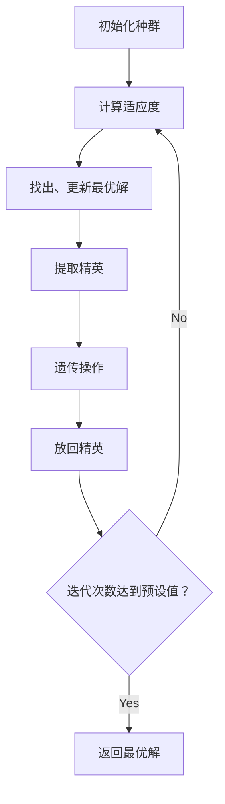
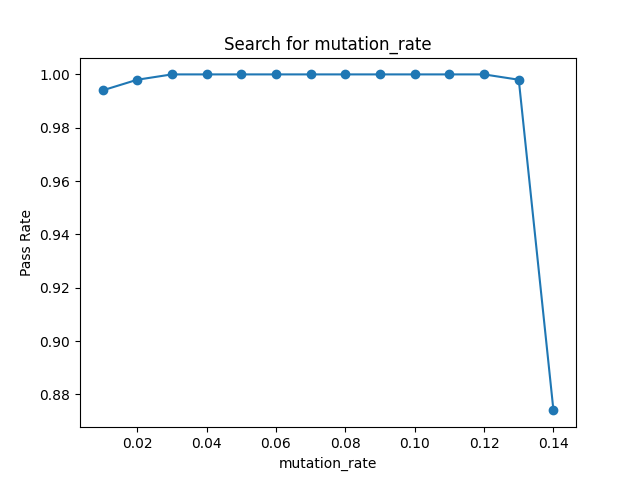
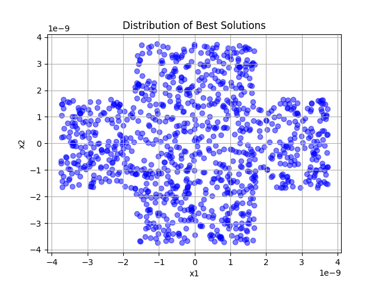
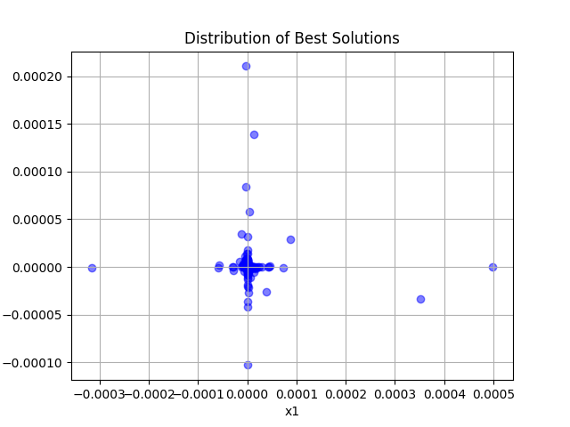

# GA

# 一、GA 算法流程

## 1.1 总体流程

开始运行遗传算法（Genetic Algorithm, GA）前，需要先确定适应度函数，染色体编码方式，并初步设定算法参数（例如种群规模、迭代次数、交叉变异概率等）.

算法首先初始化种群，然后进入迭代过程. 在每一轮迭代中，先对种群中所有个体计算适应度，并据此更新当前全局最优解. 随后，为了防止优良个体在遗传中破坏或丢失，从种群中提出适应度排名靠前的若干个体，作为本轮迭代的精英予以保留（即精英保留策略）.

接下来进行遗传操作，包含以下三个步骤：
（一）选择：根据适应度选出优良的个体，以它们作为本轮迭代的父代；
（二）交叉：根据预设的交叉概率，以一定的交叉算法综合两个父代的染色体，产生子代；
（三）变异：根据预设的更小变异概率，使种群中个体产生变异.

完成以上遗传操作后，把先前提取的精英个体重新引入种群.
当迭代达到预设的轮次或满足其它终止条件后，算法终止，并返回当前最优个体. 根据编码策略，可能需要把其染色体解码回原问题解空间.

## 1.2 各关键操作说明
	
### 1.2.1 适应度函数

本实验的目标是求 Rastrigin 函数极小值点，属于最小化问题，因此我们可以令

$$ \mathrm{fitness}(x) = − \mathrm{Ras}(x). $$

### 1.2.2 编码

选择了实数编码，直接用二维实向量 $(x_1, x_2) \in [-5.12, 5.12]^2$ 作为染色体.

该编码方式与目标函数定义域一致，避免了二进制编码中编码、解码带来的额外误差和计算开销. 实数编码还允许我们直接使用适合连续变量的交叉和变异算子，如 SBX 和高斯变异，从而提升搜索效率和解的质量.

### 1.2.3 选择方法

使用了锦标赛选择.

从群体中随机选择 $k$ 个个体加入锦标赛小组，将冠军（即其中适应度最高的个体）保存到下一代. 这一过程反复执行，直到下一代的数量达到种群规模.

当锦标赛规模较小时，有利于保持多样性；规模增大时则更偏向快速收敛. 本实验取 $2$，在探索与开发之间取得了较平衡的效果.

### 1.2.4 交叉方法

使用了模拟二进制交叉（Simulated Binary Crossover, SBX）.

SBX 的核心思想是在连续空间中模拟二进制交叉的重组特性，通过分布指数 $\eta$ 控制子代与父代的距离分布：

设一对父代在某一维上的取值为 $p_1, p_2$. 先采样随机变量 $u\sim U(0,1)$，并构造扩展系数

$$
\beta_q=
\begin{cases}
(2u)^{\frac{1}{\eta+1}}, & u \le 1/2 \\
\left(\frac{1}{2(1-u)}\right)^{\frac{1}{\eta+1}}, & u > 1/2
\end{cases} .
$$

再由下式生成两子代：

$$
\begin{cases}
c_1=\frac{1}{2}\big[(1+\beta_q)p_1+(1-\beta_q)p_2\big] \\
c_2=\frac{1}{2}\big[(1-\beta_q)p_1+(1+\beta_q)p_2\big]
\end{cases} .
$$

从个体看，$\beta_q$ 直接决定子代相对父代区间的位置：当 $0<\beta_q<1$ 时，子代位于父代区间内部；当 $\beta_q=1$ 时，子代退化为父代边界点；当 $\beta_q>1$ 时，子代可落在父代区间外，从而增强跨盆地探索能力.

因此，相较于简单线性交叉，SBX 在多峰函数上通常具有更好的搜索表现：线性交叉本质是父代凸组合，子代严格受限于父代连线区间，较难跨越局部极小值盆地；而 SBX 允许在保留父代结构信息的同时进行区间外采样，可产生更远但仍受控的搜索步长.

从全局看，$\eta$ 决定了 $\beta_q$ 的分布形态：$\eta$ 较大时，$\beta_q$ 更集中在 $1$ 附近，子代更贴近父代，偏向局部开发；$\eta$ 较小时，$\beta_q$ 分布更分散，出现较大步长（含区间外采样）的概率更高，偏向全局探索. 因而通过调节 $\eta$，可以在探索与开发之间实现可控平衡，更容易在多峰地形中兼顾跳出局部最优与后期收敛.

### 1.2.5 变异方法

使用了高斯变异.

# 二、代码设计分析

## 2.1 主程序流程图设计及分析



## 2.2 关键代码段说明

### 2.2.1 GA 主循环代码说明

```python
def start(self) -> ChromoWithFitness:
    pop = self.sample(self.pop_size)
    best: ChromoWithFitness = np.zeros(2), -inf

    for gen in range(self.generations):
        fitness_v = self.calc_fitness_v(pop)
        best = self.update_best(best, pop, fitness_v)

        elites = self.extract_elites(pop, fitness_v)

        pop = self.select(pop, fitness_v)
        pop = self.crossover(pop)
        pop = self.mutate(pop)

        pop = self.inject_elites(pop, elites)

    return best
```

算法主循环结构位于 `GA` 抽象类中，与遗传算法流程完全一致：初始化种群、计算适应度、提取精英、遗传操作、放回精英. 适应度计算、遗传操作、采样由子类（本实验中为 `RasGA`）实现.

### 2.2.2 锦标赛选择代码说明

```python
def select(self, pop: Population, fitness_v: Values) -> Population:
    candidates = np.random.randint(0, self.pop_size, size=(self.pop_size, self.tournament_size))
    best_idx = np.argmax(fitness_v[candidates], axis=1)

    selected_idx = candidates[np.arange(self.pop_size), best_idx]
    new_pop = pop[selected_idx]

    return new_pop
```

由于各轮锦标赛是独立的，我们可以将锦标赛选择过程向量化，即随机产生种群规模个数的锦标赛小组，并同时计算每个小组的冠军，一次性形成下一代.

### 2.2.3 SBX 交叉代码说明

```python
def crossover_sbx(self, pop: Population) -> Population:
    N, D = pop.shape
    eta = self.sbx_eta

    parents_1 = pop[0::2]
    parents_2 = pop[1::2]
    offspring = pop.copy()

    u = np.random.rand(N // 2, D)
    mask = u <= 0.5
    beta = np.empty_like(u)
    beta[mask] = (2 * u[mask]) ** (1 / (eta + 1))
    beta[~mask] = (1 / (2 * (1 - u[~mask]))) ** (1 / (eta + 1))

    children_1 = 0.5 * ((1 + beta) * parents_1 + (1 - beta) * parents_2)
    children_2 = 0.5 * ((1 - beta) * parents_1 + (1 + beta) * parents_2)

    cross_mask = (np.random.rand(N // 2) < self.crossover_rate)[:, None]
    offspring[0::2] = np.where(cross_mask, children_1, parents_1)
    offspring[1::2] = np.where(cross_mask, children_2, parents_2)

    offspring = np.clip(offspring, xl, xu)

    return offspring
```

该函数向量化地实现了 SBX 交叉过程并利用遮罩应用交叉概率. 由于无界 SBX 交叉产生的区间外采样可能超出解空间范围，最后需要手动对子代进行裁剪.

# 三、调试说明、结果记录及分析

## 3.1 调试说明

### 3.1.1 算法参数

以下为本次实验中使用的算法参数设置及说明：

```python
RasGA(
    pop_size=100,               # 种群规模
    generations=200,            # 迭代次数

    crossover_mode="sbx",       # 交叉方式
    elitism_count=2,            # 精英保留数量
    tournament_size=2,          # 锦标赛选择的参赛个体数量

    mutation_rate=0.1,          # 变异概率
    crossover_rate=1.0,         # 交叉概率
    sbx_eta=2.72,               # SBX 交叉 中的 η 参数
    mutate_noise_std=0.7,       # 变异时高斯噪声的标准差
)
```

这些参数又分为三类：

（一）种群规模、迭代次数. 这两个参数为固定值，我们在保持它们不变的前提下，调整其它参数，以观察它们对算法性能的影响. 我们使用准确率来评估算法性能：在 $n$ 次独立实验中，算法成功找到全局最优解（以 $|x_i| < \varepsilon$ 为准）的次数占总实验次数的比例.

（二）交叉方式、精英保留数量、锦标赛选择的参赛个体数量. 这 3 个参数是离散的，经过简单测试我们已经确定了 SBX 交叉显著优于线性交叉，精英保留数量为 $2$ 时表现较好，锦标赛选择的参赛个体数量为 $2$ 时表现较好，因此我们在后续实验中也保持它们不变.

（三）变异概率、交叉概率、SBX 交叉中的 $\eta$ 参数、变异时高斯噪声的标准差. 这 4 个参数是连续的，其中 $\eta$ 参数尤为关键. 我们通过根据准确率区间搜索参数的方式，经过多轮搜索，最终确定了上述参数设置. 例如图 2 中为搜索最佳变异概率的结果.



## 3.2 结果记录及分析

我们取 $n = 1000, \varepsilon = 10^{-6}$，在上述参数设置下，算法的准确率达到了 $100\%$，各次运行最优解分布如图 3 所示.



特别地，我们还测试了算法在低精度高效率的场景下的表现. 我们取 $n = 1000, \varepsilon = 10^{-2}$，将上述参数中种群规模改为 $20$，其它参数不变. 此时算法的准确率仍然达到了 $100\%$，各次运行最优解分布如图 4 所示.



分析：

（一）对于当前问题，算法准确率较高. 在低精度高效率的场景下表现也较好.

（二）SBX 的表现明显优于线性交叉，说明其在连续空间中兼具局部开发和适度探索能力更符合该实验需求.

（三）最优解分布呈十字形，与 SBX 各维度独立交叉的特性一致：每次交叉仅在某些维度上产生较大变异，导致子代在某些维度上可能远离父代，从而形成沿坐标轴分布的解.

# 四、实验收获及心得

- 掌握了遗传算法的基本流程和关键操作，学习了实数编码下的各类遗传操作算法.
- 学习了 NumPy 中广播、遮罩等向量化计算的技巧，能运用向量化更高效地实现算法.
- 理解了遗传算法中探索与开发的平衡问题，以及如何通过各个环节中的算法选择、参数调节来实现这一平衡.