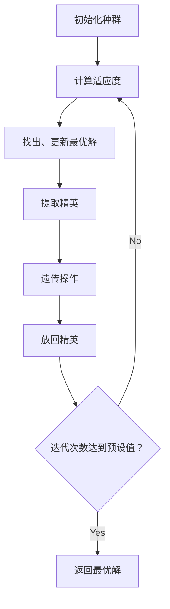

```mermaid
flowchart TD
    1[初始化种群]

    --> 2.1[计算适应度]
    --> 2.2[找出、更新最优解]
    --> 2.3[提取精英]
    --> 2.4[遗传操作]
    --> 2.5[放回精英]

    --> 2.x{迭代次数达到预设值？}

    2.x -- No --> 2.1
    2.x -- Yes --> 3[返回最优解]
```