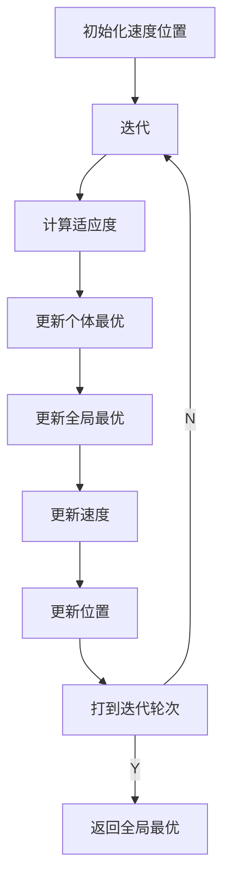
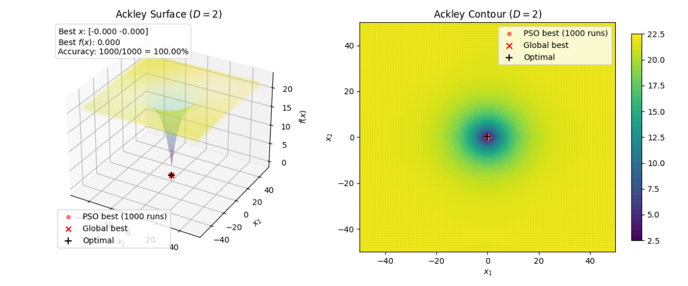
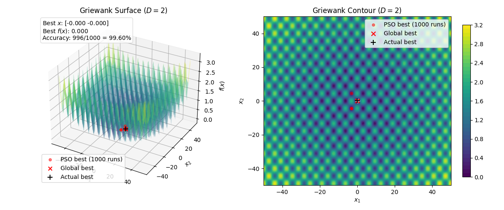
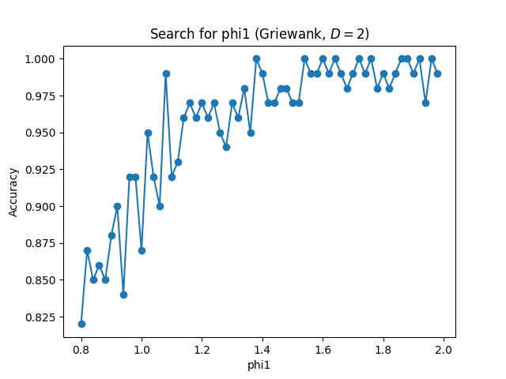

# PSO

# 一、PSO 算法流程分析

## 1.1 总体流程

本实验使用粒子群优化算法（Particle Swarm Optimization, PSO）求解若干连续函数的最小值点，并用基于适应度的多次实验准确率评估、优化算法性能。

PSO的整体流程如下：

1. 在搜索空间内随机初始化粒子位置 $(x_i)$ 与速度 $(v_i)$。
1. 计算当前群体中每个粒子的适应度，并更新粒子历史最优位置 $(x_{\mathrm{pb}i})$。
1. 在所有粒子的历史最优中找出全局最优位置 $(x_\mathrm{gb})$。
1. 按照速度更新公式调整下一步的速度，再更新粒子位置。
1. 若达到最大迭代次数，则停止；否则继续迭代。

## 1.2各关键操作说明

### 1.2.1 速度更新

对第 $i$ 个粒子，每轮迭代按照以下步骤更新其速度：

$$
\begin{align*}
v_i &\gets ω_t v_i + φ_1 r_1 (x_{\mathrm{pb}i} - x_i) + φ_2 r_2 (x_\mathrm{gb} - x_i) \\
v_i &\gets \mathrm{clamp}(v_i, -v_{\max}, v_{\max})
\end{align*}
$$

其中：

- $ω_t$ 为当前迭代的惯性权重，控制粒子维持原有速度的趋势；
- $φ_1$ 为个体学习因子，控制粒子靠近个体最优的趋势；
- $φ_2$ 为社会学习因子，控制粒子靠近全局最优的趋势；
- $r_1, r_2 \sim U(0,1)$ 是随机数；
- $\mathrm{clamp}$ 函数表示裁剪更新后的 $v_i$ 到允许范围内。

### 1.2.2 位置更新

对第 $i$ 个粒子，每轮迭代按照以下步骤更新其位置：

$$
\begin{align*}
x_i &\gets x_i + v_i \\
x_i &\gets \mathrm{clamp}(x_i, x_{\min}, x_{\max})
\end{align*}
$$

即将位置更新为原位置加上更新后的速度，并裁剪到搜索空间内。

### 1.2.3 线性递减惯性权重（Linearly Decreasing Inertia Weight, LDW）

惯性权重被设计为随迭代轮次从 $ω$ 到 $ω_{\min}$ 线性衰减：

$$
ω_t = ω + (ω_{\min} - ω)\frac{t}{T}
$$

其中，$t$ 是当前轮次，$T$ 是总轮次。

通过惯性权重的线性递减，可以达成前期鼓励探索、后期加强收敛的效果，优化算法收敛速度。

# 二、代码设计分析

## 2.1主程序流程图设计及分析 



## 2.2 关键代码段说明

### 2.2.1 PSO 主循环

```python
for gen in range(self.gen_max):
    f = self.fitness(x)
    is_better = f > best_f
    best_x[is_better] = x[is_better]
    best_f[is_better] = f[is_better]
    best_x_g = best_x[np.argmax(best_f)]

    alpha = gen / self.gen_max
    omega = self.omega + (self.omega_min - self.omega) * alpha

    v = (
        omega * v
        + self.phi1 * np.random.uniform(size=ND) * (best_x - x)
        + self.phi2 * np.random.uniform(size=ND) * (best_x_g - x)
    )

    v = np.clip(v, -self.v_max, self.v_max)
    x += v
    x = np.clip(x, self.xl, self.xu)
```

这段代码向量化地实现了标准 PSO 流程，即每轮迭代：

1. 先计算当前适应度。
2. 更新每个粒子的历史最优。
3. 再更新全局最优。
4. 根据惯性项、个体认知项、社会认知项更新速度。
5. 更新位置并裁剪到边界内。

### 2.2.2 准确率

```python
success = (
    case.calc_fitness(res.best_x) + tol >= optimal.fitness
)
success_count = np.sum(success)
accuracy = success_count / runs
```

我们定义一次运行通过的条件为：此次运行得到全局最优的适应度与理论解的适应度差值小于容忍度。随后，我们可以重复实验根据通过次数估算准确率。

# 三、调试说明、结果记录及分析  

## 3.1 实验结果及分析

根据要求，我们分别对 Ackley 函数和 Griewank 函数在 2D、30D 下进行了测试。图 1 和图 2 展示了两个函数2D下各次实验最优解在函数曲面与 Contour 图上的分布。





可以看出，寻找 Ackley 函数极小值点对 PSO 算法来说比较轻松，准确率达到了 100.0%；而 Griewank 函数由于其多峰的特性，可能使 PSO 算法陷入原点附近的局部最优，但是经过参数优化，也能达到 99.6% 的准确率。

而在 30D 下，保持参数不变，对 Ackley、Griewank 函数算法的准确率分别下降到 98.2%、71.5%。这体现了传统 PSO 算法难以处理高维多峰函数的局限性。

## 3.2 算法关键参数对实验结果的影响 

我们以经验参数为起点，以准确率为优化目标，使用脚本搜索了 $φ_1$、 $φ_2$、 $ω$、 $ω_{\min}$、 $v_{\max}$ 这几个参数的最优值。（图 3 为搜索 $φ_1$ 的过程）



最终，我们确定算法参数如下：

$$
\begin{cases}
v_{\max} &= 0.233 \cdot x_\mathrm{b} \\
ω &= 0.920 \\
ω_{\min} &= 0.164 \\
φ_1 &= 2.307 \\
φ_2 &= 0.771
\end{cases}
$$

其中， $x_\mathrm{b}$ 是搜索空间半径。

通过对 PSO 的理论分析和实验数据，我们认为以上 PSO 核心参数的影响如下：

- 认知因子 $φ_1$、社会因子 $φ_2$：这两项决定粒子向个体最佳与全局最佳接近的加速度，平衡群体多样性和跳出局部最优的能力。除了这两个参数自身取值外，其和 $φ_1 + φ_2$ 也是影响算法的重要因素，若和过大会使速度发散，影响系统稳定性，因而需配合 $v_{\max}$ 限制粒子速度。
- 惯性权重初值 $ω$、惯性权重末值 $ω_{\min}$：惯性权重决定单次迭代中全局探索和局部开发倾向。前期，较大的惯性权重使粒子偏向持续探索；后期，较小的惯性权重使粒子偏向精细开发。因此， $ω_{\min}$ 不宜过高，否则后期粒子仍然有较强探索性，收敛精度不足；也不宜过低，否则容易陷入局部最优。
- 最大速度 $v_{\max}$：最大速度决定了系统整体的全局探索和局部开发倾向。若 $v_{\max}$ 过大并且 $φ_1 + φ_2$ 使得系统发散，则粒子群的行为近似退化为在搜索空间内随机采样，效果下降；若 $v_{\max}$ 过小则难以跳出局部最优。

# 四、实验收获及心得

- 掌握了 PSO 的基本原理，算法结构与具体实现。
- 认识到了传统 PSO 在高维情形下的局限性，初步了解了各类改进 PSO。
- 理解了惯性权重、认知因子、社会因子、最大速度如何共同决定探索和开发的平衡。
- 了解了 Contour 图对于可视化 2D 算法结果分布的便利性，并在调试中应用。
- 理解了用解之差和适应度之差定义准确率这两种选择的区别：解之差以靠近理论解为优化目标，更加严格；适应度之差则要求找到足够好的解，更具实用风格。
